# Introduction
This project is a simple Todo Application with basic functionality:
- View existing tasks
- Create a task
- Update task status

The frontend is built with **Adobe React Spectrum** and a **Relay GraphQL client**.  
The backend is implemented in **.NET 8 Core**, **GraphQL with HotChocolate** and a **SQLite** database.

# Design rationale
- Technology choices are primarily driven by project requirement.
- GraphQL is an excellent choice as it hides all the complexities of writing API's to query and mutate data.
- Adobe React Spectrum provides theming and implicit support for accessibility.
- Docker is a good choice to develop a deployment ready solution. 
- Added resolver to convert string to id and vice-versa to support integer primary keys.
- Broken down the frontend application into multiple components which is a norm while building react applications.
- Generalized the header component (application + page header) to maintain consistency throughout the application.
- Context menu can be set by each page as per its requirement and can be passed to the Application Header component.
- Instantly saving the task state to database, to prevent stale states in the application vs the backend.

# AI tools

I used ChatGPT, Claude Sonnet, and Gemini AI models to generate the initial project skeleton and boilerplate code for various components. GitHub Copilot was especially helpful in quickly creating the backend, which was completed in about an hour. The frontend project structure, build configurations, Relay integration, and Docker setup were also accelerated by AI assistance.

However, building the Adobe React Spectrum-based components required more manual effort. Since the AI models were not fully up-to-date with the latest React Spectrum documentation, I had to consult the official docs to resolve several issues. Mostly, there was a gap between what AI was suggesting vs the actual documentation. Overall, AI tools significantly sped up the development process, but hands-on research was still necessary for newer or less-documented technologies.

# Backend Components

The backend is a .NET 8 Core application using Entity Framework Core, SQLite, and the HotChocolate GraphQL server.

### Entry Point
The main initialization and setup logic is defined in  
[`Program.cs`](./backend/TodoApi/Program.cs).

## SQLite Database
The application uses **Entity Framework Core** with a SQLite database (`tasks.db`).  
The database and schema are automatically created on application startup.

## GraphQL API
The backend integrates a GraphQL server using the **HotChocolate** library, with query and mutation handlers defined under the `GraphQL` folder. The API is accessible at the `/graphql` endpoint.

It provides the following operations:

- **GetAllTasks**  
  Retrieves the list of existing tasks from the database.  
  Implemented in [`Query.cs`](./backend/TodoApi/GraphQL/Query.cs).

- **CreateTask**  
  Creates a new task with a unique ID. The default status of a newly created task is `pending`.  
  Implemented in [`Mutation.cs`](./backend/TodoApi/GraphQL/Mutation.cs).

- **UpdateTaskStatus**  
  Updates the task status between `pending` and `completed`.  
  Implemented in [`Mutation.cs`](./backend/TodoApi/GraphQL/Mutation.cs).

## Runtime
The project is built and tested with **.NET 8** and is compatible with **.NET 9**.

## Dependencies
The backend depends on the following NuGet packages:

```xml
<PackageReference Include="HotChocolate.AspNetCore" Version="15.1.10" />
<PackageReference Include="Microsoft.AspNetCore.OpenApi" Version="8.0.20" />
<PackageReference Include="Microsoft.EntityFrameworkCore" Version="8.0.20" />
<PackageReference Include="Microsoft.EntityFrameworkCore.Sqlite" Version="8.0.20" />
```

# Frontend Components
The frontend is a react application with following main components. The Relay compiler (`relay-compiler`) uses the GraphQL schema and the `graphql` tags in the components to generate the necessary JavaScript modules. These modules are then used by the Relay client at runtime to handle data fetching and management. 

## Application Header
The application header component provides a common header to all the the other child components. It accepts the context menu component and the page title. It adds the context menu next to the Main application title and the page title below the application title.
Implemented in [`ApplicationHeader.js`](./frontend/src/ApplicationHeader.js).

## Landing Page
Displays the list of tasks and if no task is present, displays a message with **create new task** button options. it also provides **New Task** option in the context menu.
Implemented in [`LandingPage.js`](./frontend/src/LandingPage.js).

## New Task Detail Page
The new task detail page provides the form to enter the details of a new task. It provides two options to discard and save the task
Implemented in [`NewTaskPage.js`](./frontend/src/NewTaskPage.js).

## Task Detail Page
The task detail page provides an option to mark a task ""pending"" or **completed**. The status change is instantly saved in the database to avoid user marking the task **completed** and then forgetting to save it. 
Implemented in [`TaskDetailPage.js`](./frontend/src/TaskDetailPage.js).

# Getting Started

This application can be run using Docker and `docker-compose`.

## Prerequisites

*   [Docker](https://www.docker.com/products/docker-desktop) installed on your machine.

## Running the Application

1.  Clone the repository to your local machine.
2.  Open a terminal in the root directory of the project.
3.  Run the following command to build and start the containers:

    ```bash
    docker-compose up --build
    ```

4.  Once the containers are running:
    *   The frontend will be accessible at [http://localhost:3000](http://localhost:3000).
    *   The backend GraphQL endpoint will be available at [http://localhost:8080/graphql](http://localhost:8080/graphql).

# Screenshots
| | |
|----------|----------|
|**Light Theme Version**|
|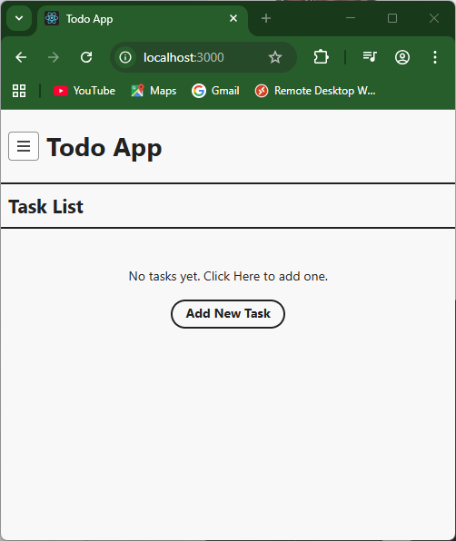<BR/>Landing page with no tasks and **Create New task** option|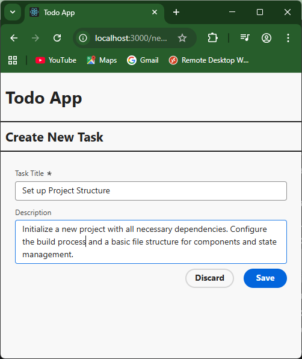<BR/>Create New Task page with option to **Discard** and **Save** options|
|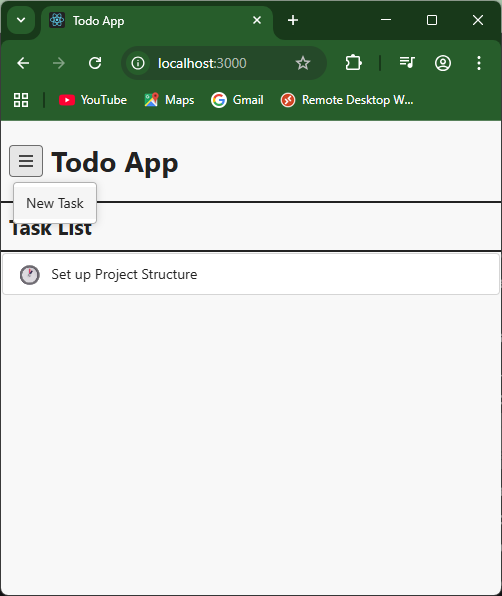<BR/>Landing page with **New Task** menu option to create new task|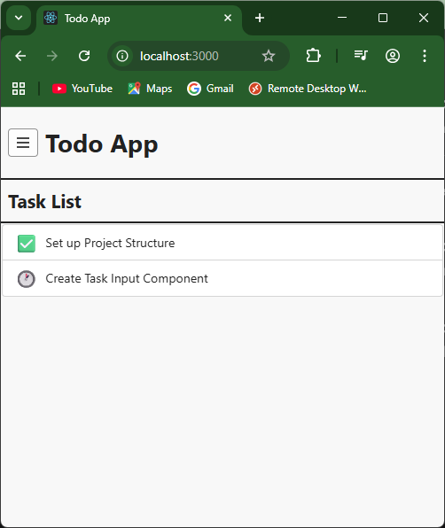<BR/>Landing page with 1 **completed** and 1 **pending** task|
|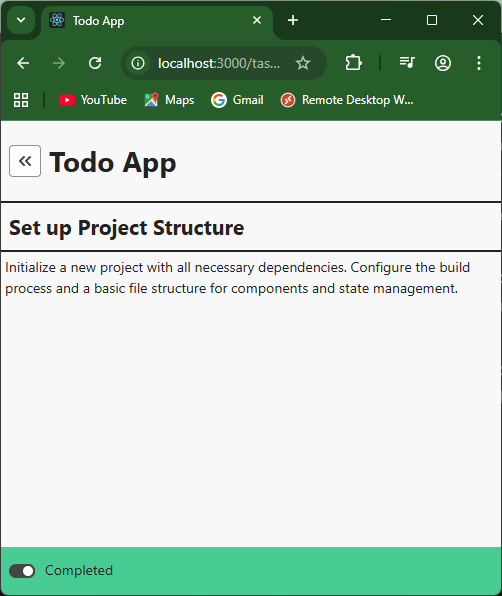<BR/>Task page with task in **Pending** state|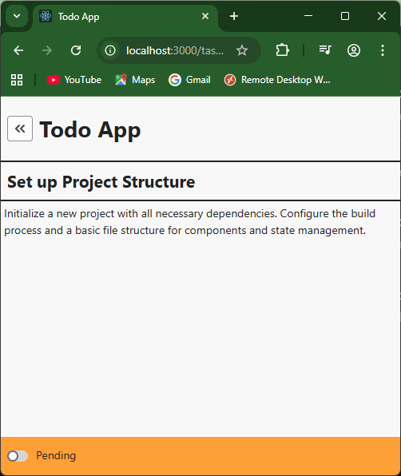<BR/>Task page with task in **Completed** state|


| | |
|----------|----------|
|**Dark Theme Version**|
|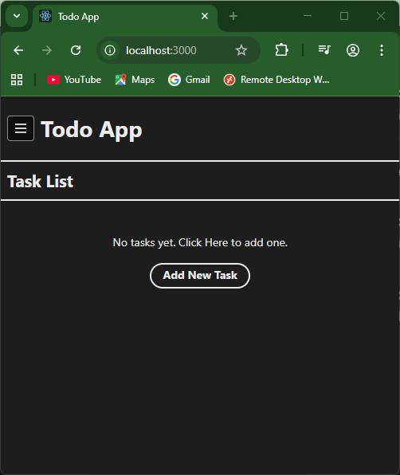<BR/>Landing page with no tasks and **Create New task** option|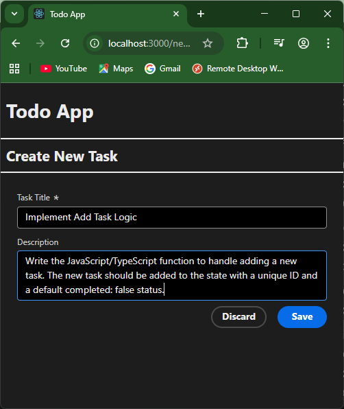<BR/>Create New Task page with option to **Discard** and **Save** options|
|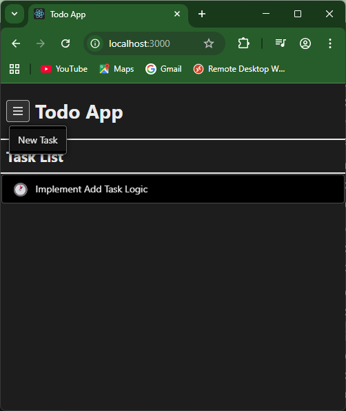<BR/>Landing page with **New Task** menu option to create new task|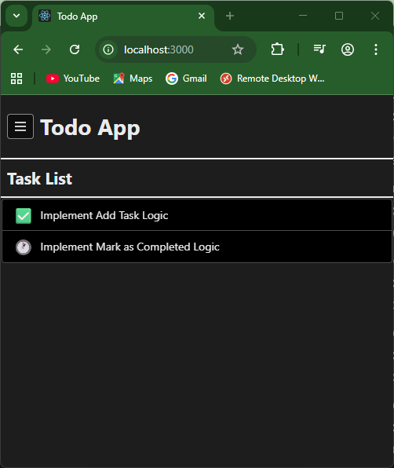<BR/>Landing page with 1 **completed** and 1 **pending** task|
|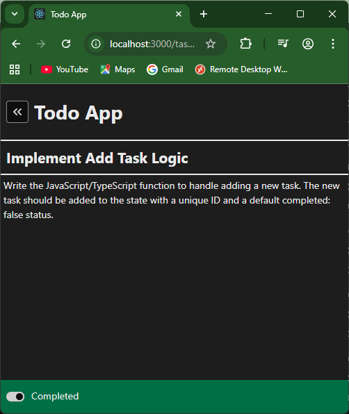<BR/>Task page with task in **Pending** state|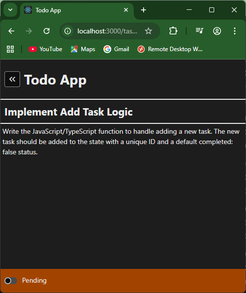<BR/>Task page with task in **Completed** state|


